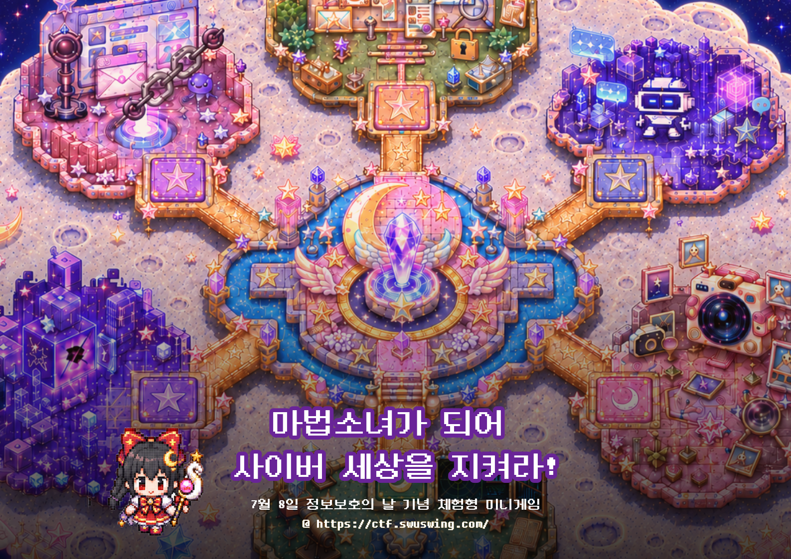

# KUCIS Security RPG

  

  <a href="https://sonotri.github.io/KUCIS/" target="_blank"><strong>게임 플레이하기</strong></a>

 

## 프로젝트 소개

**KUCIS Security RPG**는 정보보호와 개인정보보호 개념을 쉽고 재미있게 전달하기 위해 제작한 RPG Maker MZ 기반 웹 미니게임입니다.

플레이어는 **Lumina Station**에서 보안 마법소녀가 되어 어둠의 마법에 오염된 6개의 Security 월드를 탐험합니다. 각 월드의 문제를 해결하면 보안 크리스탈과 배지를 획득할 수 있으며 모든 배지를 모으면 최종 칭호 **사이버 수호자**가 수여됩니다.

 

## 플레이 방식

- 포탈을 선택해 각 Security 월드에 입장합니다.
- 문제 설명을 읽고 미션을 해결합니다.
- 정답과 오답 피드백 그리고 3줄 요약을 통해 핵심 보안 개념을 학습합니다.
- 월드를 클리어하면 주제별 보안 배지를 획득합니다.
- 6개 배지를 모두 모으면 최종 퀴즈와 엔딩 크레딧이 진행됩니다.

 

## 주요 보안 시나리오

각 Security 월드는 실제 사이버 위협과 보안 개념을 바탕으로 직접 기획·개발했습니다.

- Prompt Injection 취약점과 생성형 AI 보안
- 디지털 포렌식과 침해 흔적 분석
- 개인정보보호와 안전한 데이터 처리
- 피싱 및 소셜 엔지니어링
- Bof 취약점 개념과 예방 방법
- 로그 개념 및 로그로부터 얻을 수 있는 정보

플레이어가 다양한 위협 상황을 직접 해결하면서 보안 원리와 대응 방법을 자연스럽게 익힐 수 있도록 구성했습니다.

 

## 제작

<table align="center">
  <tr>
    <td align="center" width="200">
      <a href="https://github.com/sonotri">
         
        <strong>sonotri</strong>
      </a> 
      Planning · Development · Design · Security Scenario
    </td>
    <td align="center" width="200">
      <a href="https://github.com/yebbis">
         
        <strong>Yebbi</strong>
      </a> 
      Planning · Development · Design · Security Scenario
    </td>
    <td align="center" width="200">
      <a href="https://github.com/jenna8225">
         
        <strong>bage2room</strong>
      </a> 
       Development · Design Platform
    </td>
    <td align="center" width="200">
      <a href="https://github.com/y00nsssu">
         
        <strong>y00nsssu</strong>
      </a> 
       Development · Design Platform
    </td>
    <td align="center" width="200">
      <a href="https://github.com/2seoyg">
         
        <strong>2seoyg</strong>
      </a> 
       Development · Design Platform
    </td>
  </tr>
</table>
